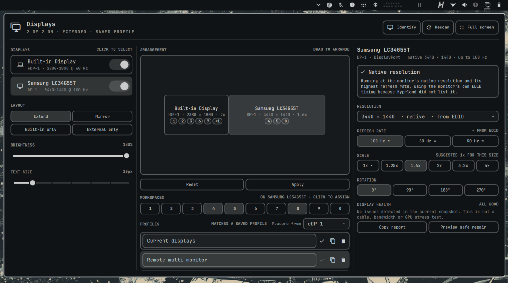

# Better Displays Pro

Better Displays Pro is an Omarchy shell bar plugin for monitors and displays.
It puts every display setting on one wide panel. Nothing is hidden in collapsible sections: turn screens on and
off, arrange them, choose resolution, refresh rate, scale and rotation, assign
workspaces and manage profiles, each one click away. The panel is sized to
fit on a 1280×720 screen.

It also works out what your monitors can actually do. Each monitor's EDID is
decoded, so the panel knows the native resolution even when Hyprland's own
mode list is stale or incomplete, which is common behind USB-C docks and
DP-to-HDMI adapters. When a better mode exists, the panel says why and offers
it as a single button.



It is not related to the separate
[Better Displays](https://github.com/nightdevil00/better.displays) plugin.

## Install

```bash
omarchy plugin add https://github.com/dragosol/omarchy-better-displays.git --enable
```

Omarchy installs third-party plugins disabled unless `--enable` is provided.
Review the repository before enabling it: shell plugins run unsandboxed with
your user permissions.

Better Displays Pro is a replacement for Omarchy's built-in **Display** bar widget
(`omarchy.monitor`) and answers the same `omarchy.monitor` shell IPC commands,
so keyboard shortcuts and scripts that open the display panel keep working.
Run only one of them. If the built-in widget is still in your bar, turn it off:

```bash
omarchy plugin disable omarchy.monitor
```

## Usage

1. Click the display icon in the bar (or run `omarchy shell omarchy.monitor toggle`).
2. Click a display card on the left to select it; its settings appear on the
   right. The switch on each card turns that display on or off.
3. Pick a layout preset, drag screens in the arrangement, choose resolution,
   refresh rate, scale and rotation, or assign workspaces.
4. Keep the change when asked (see below). From then on it is remembered.

### Panel layout

| Left: your displays | Centre: arrangement | Right: the selected display |
| --- | --- | --- |
| A card per display with an on/off switch; click a card to select it | Drag screens to match your desk; Apply previews, Keep saves and remembers | Native-mode insight with a one-click fix |
| Layout presets: Extend, Mirror, Built-in only, External only | Workspace 1–10 assignment for the selected display | Resolution, refresh rate, scale (with a density-based suggestion) and rotation |
| Brightness and text size | Profiles: rename, select, duplicate, delete; the anchor display | Health summary, sanitized report copy, safe repair |

The header shows the overall state (displays on, extended or mirrored,
profile match) and holds **Identify**, **Rescan** and **Full screen**, which
opens a large arrangement editor.

Keyboard: `j`/`k` walk the controls in reading order, `h`/`l` move within a
row, `Enter` activates, and in the arrangement `Enter` picks up a screen so the
arrow keys can move it.

### Native modes and connection limits

For each display the panel compares three sources:

1. **The monitor's EDID**: its preferred (native) timing and every detailed
   timing, decoded with `edid-decode -X` into exact modelines.
2. **Hyprland's advertised modes**: what the compositor offered when the
   output was set up.
3. **The live mode**: what is actually running.

From that it reports one of:

- **Native resolution**: the best mode is active.
- **Not at native resolution**, or **A better refresh rate is available**,
  with a **Use …** button that previews the recommended mode.
- **Limited by the connection**: the monitor supports a higher refresh rate at
  native resolution than the driver offers on this link. A shared USB-C dock
  lane budget or an HDMI adapter is the usual cause.

Modes that only the EDID lists are marked with `*` and "from EDID". They are
applied as the monitor's own modeline rather than silently replaced by the
nearest advertised mode. The connection may still be unable to carry them, so
the normal 15-second preview protects you: if the screen stays dark, it
reverts. When the native resolution was never advertised, the recommendation
starts at the gentlest refresh rate (the lowest at or above 50 Hz), which is
the one most likely to fit a limited link.

A live custom modeline reports a slightly drifted refresh rate (for example
59.83 Hz for a 59.97 Hz timing). The plugin maps that back to the EDID timing,
so later scale, rotation and position changes, saved profiles and automatic
restores all refer to the same mode.

### Safe changes

1. Change anything: a preset, a switch, a mode button or a dragged screen.
2. Settings and presets preview immediately. Arrangement and workspace edits
   preview when you select **Apply**.
3. Select **Keep** within 15 seconds, or **Revert**. If you do nothing, the
   previous layout comes back automatically. Closing the panel does not
   confirm anything; the confirmation overlay and a detached watchdog stay
   active.

If a preview makes the panel unreachable, run:

```bash
omarchy shell omarchy.monitor revert
```

To add a keyboard escape hatch, put this in your own Hyprland configuration
(the plugin never edits your bindings):

```text
bindd = SUPER SHIFT, BackSpace, Emergency display revert, exec, omarchy shell omarchy.monitor revert
```

### Remembering your displays

Every layout you keep is remembered, and plugging displays in puts them back
the way you last set them, with nothing to confirm:

- **The same monitors on the same ports:** the saved layout is restored as-is,
  workspaces included.
- **The same monitors on different ports** (another USB-C port or dock): the
  layout follows the monitors, and the new port combination is remembered too.
- **A new combination** (your ultrawide at a desk it has never been at, or with
  a different second screen): each monitor it recognises gets the resolution,
  refresh rate, scale and rotation you last kept for it, placed where it last
  sat relative to a display that is also connected, or to the right. Monitors
  it has never seen keep Hyprland's defaults. The result is saved as a profile
  for that combination.

The same happens after anything that resets monitors without unplugging them:
a Hyprland config reload (saving a file in `~/.config/hypr`, changing the
Omarchy theme) or a shell restart. Those restores are silent.

A short notification says what was restored; click it to **undo**. Undo puts
the previous layout back and forgets any profile the restore created. When
several profiles match, the one you selected or changed most recently wins.

Monitors are recognised by their serial number or EDID, never by make and
model alone, so identical monitors without serials are not guessed at.
Restoring waits for the connection to settle, runs once per connected set, and
never interrupts a change you are making in the panel.

The schema-v2 store keeps identity evidence, modes, arrangement, workspaces,
anchor and preset variants for each connected set:

```text
~/.local/state/omarchy/displays/profiles.json
```

An older schema-v1 `~/.local/state/omarchy/displays/layout.json` is kept as a
backup, imported only when its connector set matches exactly, and removed after
the first successful schema-v2 Keep.

The plugin never edits `~/.config/hypr/monitors.lua`. That file remains the
fallback: to discard saved profiles, delete `profiles.json` and run
`hyprctl reload`.

## Configure

There is no configuration file; everything is set from the panel and saved when
you keep a change. A few things are worth knowing:

- **Saved layouts** live in `~/.local/state/omarchy/displays/profiles.json`.
  Rename, duplicate, select or delete them in the Profiles list. Deleting the
  file forgets every remembered layout.
- **Measure from** picks the anchor display that saved positions are measured
  from, so layouts stay put when another display is added or removed.
- **Your Hyprland `monitors.lua` is never edited.** It stays the fallback for
  displays the plugin has never seen and for when the plugin is removed.
- **Kept layouts survive Hyprland reloads.** Hyprland re-applies its monitor
  rules on a config reload and on some runtime changes, such as switching a
  workspace between dwindle and scrolling. So each kept layout is also written
  as plain Hyprland rules to
  `~/.local/state/omarchy/toggles/hypr/displays-remembered.lua`, which Omarchy
  loads after `monitors.lua`. Displays are matched by monitor description (make,
  model and serial), or by connector name when a description contains unusual
  characters. The file only ever contains `hl.monitor` and `hl.workspace_rule`
  calls built from validated names and numbers. Delete it to fall back to
  `monitors.lua`.
- **Emergency revert:** if a preview ever leaves you without a usable screen,
  run `omarchy shell omarchy.monitor revert`, or bind it yourself in your
  Hyprland configuration:

  ```text
  bindd = SUPER SHIFT, BackSpace, Emergency display revert, exec, omarchy shell omarchy.monitor revert
  ```

## Remove

```bash
omarchy plugin remove io.github.dragosol.better-displays-pro
rm -f ~/.local/state/omarchy/toggles/hypr/displays-remembered.lua
omarchy plugin enable omarchy.monitor
hyprctl reload
```

Removing the plugin does not delete saved layouts. To forget them too, delete
`~/.local/state/omarchy/displays/` and
`~/.local/state/omarchy/toggles/hypr/displays-remembered.lua`. `hyprctl reload`
returns every display to your `monitors.lua` settings.

## Dependencies

Provided by a normal Omarchy installation:

- Bash, `jq`, GNU coreutils and util-linux (`setsid`)
- Hyprland's `hyprctl`
- Omarchy display helpers for brightness, scaling and text size
- Quickshell and the Omarchy shell QML modules
- Node.js on `PATH`, used to match saved layouts to connected monitors.
  Omarchy installs it globally with mise; if `node --version` fails, run
  `mise use -g node@latest`. Without it, layouts are not restored automatically.
- `edid-decode` (part of `v4l-utils`), for native-mode detection. Without it
  the panel falls back to Hyprland's advertised modes.

No root access, network access, services or background daemons are used.

## Verify a checkout

```bash
./scripts/verify-release
```

This runs the shell, model and packaging tests, including the EDID modeline and
native-mode insight suites. See [docs/acceptance-matrix.md](docs/acceptance-matrix.md)
for the manual hardware checklist.

## Security

The plugin launches local commands and changes the live Hyprland display
configuration. It downloads nothing and never uses `sudo` or `pkexec`. Monitor
names and JSON payloads are validated before they become Hyprland Lua
statements, and EDID modelines are generated from numeric fields only. EDID
make, model, description and serial text is treated as untrusted and rendered
as plain text. See [SECURITY.md](SECURITY.md) and
[docs/security-and-operations.md](docs/security-and-operations.md).

## License and attribution

MIT License. Better Displays Pro is derived from
[Monitor Studio](https://github.com/vuhungthang/omarchy-monitor-studio) by
vuhungthang, which is itself derived from the `omarchy.monitor` plugin in
[Basecamp's Omarchy](https://github.com/basecamp/omarchy). The upstream
copyright notice is retained in [LICENSE](LICENSE); see
[THIRD_PARTY_NOTICES.md](THIRD_PARTY_NOTICES.md).
